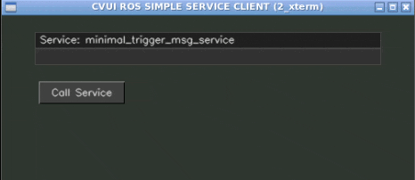

# The trigger_msg_service_client_gui package

Author: Roberto Zegers  
Date: February 2023

## Description

This package creates a graphical user interface featuring a button and a window.
When the button is clicked, a ROS service call of type `std_srvs/Trigger.h` is sent to the service server and the response message is printed inside the window.  

## Usage

- Clone to your ROS workspace, for instance into `~/catkin_ws/src`  
- Compile and source: `cd ~/catkin_ws; catkin_make; source devel/setup.bash`  
- Make sure `roscore` is running  
- Run a service server: `rosrun minimal_empty_msg_service_server minimal_empty_msg_service_server`    
- Run the service client GUI: `rosrun trigger_msg_service_client_gui trigger_msg_service_client_gui`  

## License
- BSD-3-Clause

## Dependencies
- ROS Noetic
- OpenCV
- [CVUI](https://github.com/Dovyski/cvui)